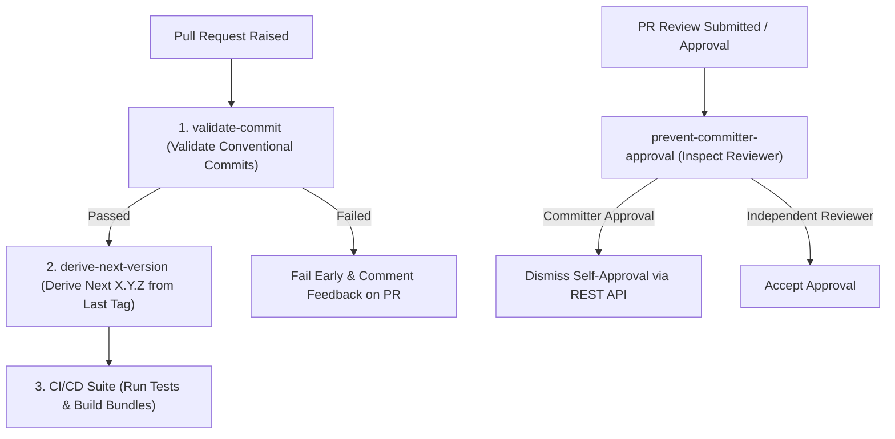

# Reusable GitHub Actions (`r_git_actions`)

A centralized collection of production-ready, reusable GitHub Actions built with the **official GitHub Actions Toolkit** and running natively on **Node 24**.

---

## 📦 Available Actions

| Action | Description | Path | Runtime |
|---|---|---|---|
| **[validate-commit](actions/validate-commit/README.md)** | Validates commit messages across PR commits with Jira key regex, optional Conventional Commits, and optional Jira REST API status check. | `ronmkr/r_git_actions/actions/validate-commit@v1` | Node 24 |
| **[setup-branching-strategy](actions/setup-branching-strategy/README.md)** | Idempotently creates branches and applies **GitHub Repository Rulesets** with industry best practices (minimum 2 approvers, CODEOWNERS, thread resolution, blocks direct commits). | `ronmkr/r_git_actions/actions/setup-branching-strategy@v1` | Node 24 |
| **[prevent-committer-approval](actions/prevent-committer-approval/README.md)** | Enforces strictly independent code reviews by preventing PR authors and committers from approving their own PRs, automatically dismissing self-approvals via GitHub REST API. | `ronmkr/r_git_actions/actions/prevent-committer-approval@v1` | Node 24 |
| **[validate-branch-promotion](actions/validate-branch-promotion/README.md)** | Enforces structured branch merge promotion policies (e.g. `dev -> uat -> prd` in GitOps, `develop -> main` in GitFlow) on Pull Requests. | `ronmkr/r_git_actions/actions/validate-branch-promotion@v1` | Node 24 |
| **[derive-next-version](actions/derive-next-version/README.md)** | Automates release versioning via Conventional Commits and SemVer 2.0, exporting outputs (`version`, `bump_type`, `has_bump`) and environment variables (`$VERSION`, `$NEXT_VERSION`). | `ronmkr/r_git_actions/actions/derive-next-version@v1` | Node 24 |
| **[action-approval-gate](actions/action-approval-gate/README.md)** | Interactive approval gate allowing designated actors to approve or reject subsequent actions or workflow steps (e.g., terraform plan -> approve -> apply). | `ronmkr/r_git_actions/actions/action-approval-gate@v1` | Node 24 |

---

## 🔄 Sequential Action Pipeline Lifecycle

All actions integrate sequentially in production workflows:



1. **When PR is Raised (`opened`, `synchronize`, `reopened`)**:
   - **`validate-commit`**: Validates commit messages for Conventional Commits and optional Jira ticket formats.
   - **`derive-next-version`**: Discovers previous tag from GitHub API, parses commits, derives next version (`X.Y.Z`), and exports `$VERSION`.
   - **CI/CD Suite**: Starts test execution and bundle verification only after version derivation succeeds.
2. **At Every Review Approval (`pull_request_review: [submitted, edited]`)**:
   - **`prevent-committer-approval`**: Immediately verifies reviewer independence and automatically dismisses author/committer self-approvals.

---

## 🚀 Quick Usage

### 1. Enforce Commit Standards (`validate-commit`)

```yaml
name: "Commit Compliance"

on:
  pull_request:
    types: [opened, synchronize, reopened]

jobs:
  validate:
    runs-on: ubuntu-latest
    steps:
      - name: Validate PR Commits
        uses: ronmkr/r_git_actions/actions/validate-commit@v1
        with:
          require-jira-id: "true"
          jira-project-keys: "PROJ,CORE"
          check-conventional-commit: "true"
```

### 2. Prevent Committer Self-Approvals (`prevent-committer-approval`)

```yaml
name: "Independent Code Review Enforcement"

on:
  pull_request:
    types: [opened, synchronize, reopened]
  pull_request_review:
    types: [submitted, edited]

jobs:
  enforce-independent-review:
    runs-on: ubuntu-latest
    permissions:
      pull-requests: write # Required to dismiss non-compliant reviews
    steps:
      - name: Dismiss Committer Approvals
        uses: ronmkr/r_git_actions/actions/prevent-committer-approval@v1
        with:
          github-token: ${{ secrets.GITHUB_TOKEN }}
          fail-on-violation: "true"
          post-comment: "true"
```

### 3. Validate PR Branch Promotion Flow (`validate-branch-promotion`)

```yaml
name: "Branch Promotion Compliance"

on:
  pull_request:
    branches: [main, develop, uat, prd]

jobs:
  check-promotion:
    runs-on: ubuntu-latest
    permissions:
      pull-requests: write # Required for posting explanatory PR feedback comments
    steps:
      - name: Validate Promotion Hierarchy
        uses: ronmkr/r_git_actions/actions/validate-branch-promotion@v1
        with:
          strategy: "gitops" # Enforces dev -> uat -> prd
          fail-on-violation: "true"
          post-comment: "true"
```

### 4. Setup Branches & GitHub Rulesets (`setup-branching-strategy`)

```yaml
name: "Setup Branching Strategy"

on:
  workflow_dispatch:

jobs:
  setup-rulesets:
    runs-on: ubuntu-latest
    steps:
      - name: Setup GitOps Strategy with Rulesets
        uses: ronmkr/r_git_actions/actions/setup-branching-strategy@v1
        with:
          strategy: "gitops"
          allowed-actors: "ronmkr,alice" # Restrict workflow execution
          required-approvals: "2"       # Production baseline (min 2)
          require-code-owner-review: "true"
          require-review-thread-resolution: "true"
          require-last-push-approval: "true"
          github-token: ${{ secrets.ADMIN_PAT }}
```

### 5. Automated SemVer 2.0 Release Versioning (`derive-next-version`)

```yaml
name: "Release Versioning"

on:
  push:
    branches: [main]

jobs:
  semver:
    runs-on: ubuntu-latest
    permissions:
      contents: read
    steps:
      - name: Checkout Code
        uses: actions/checkout@v4

      - name: Compute Next SemVer
        id: semver
        uses: ronmkr/r_git_actions/actions/derive-next-version@v1
        with:
          github-token: ${{ secrets.GITHUB_TOKEN }}
          default-version: "0.1.0"

      - name: Output Next Version
        run: |
          echo "Calculated Version: ${{ steps.semver.outputs.version }}"
          echo "Environment VERSION: $VERSION"
          echo "Bump Type: ${{ steps.semver.outputs.bump_type }}"
```

---

## 🗂 Repository Structure

```text
r_git_actions/
├── .github/
│   ├── dependabot.yml           # Automated monthly dependency updates across all actions
│   └── workflows/
│       ├── ci.yml               # Automated CI test suite, linting, and bundle drift checks
│       └── review-governance.yml# Independent code review governance on review approvals
├── actions/                     # Individual reusable actions
│   ├── derive-next-version/
│   │   ├── action.yml           # Action metadata (Node 24 runtime)
│   │   ├── package.json         # Toolkit dependencies & build/test scripts
│   │   ├── src/
│   │   │   ├── main.ts          # Action orchestration (discover, analyze, bump, export)
│   │   │   ├── tags.ts          # Discovers previous valid SemVer tag from GitHub API
│   │   │   ├── commits.ts       # Conventional Commits parser and bump evaluator
│   │   │   ├── semver.ts        # SemVer 2.0 parser, comparator, and incrementor
│   │   │   ├── summary.ts       # GitHub Actions Step Summary renderer
│   │   │   └── __tests__/       # Comprehensive Jest unit test suite (23 tests)
│   │   ├── dist/
│   │   │   └── index.js         # Compiled standalone executable
│   │   └── README.md            # Action documentation
│   ├── prevent-committer-approval/
│   │   ├── action.yml           # Action metadata (Node 24 runtime)
│   │   ├── package.json         # Toolkit dependencies
│   │   ├── src/
│   │   │   ├── main.ts          # Action orchestration
│   │   │   ├── committers.ts    # Extract all PR authors & committers
│   │   │   ├── reviews.ts       # Resolve active approval decisions
│   │   │   ├── dismissal.ts     # Dismiss non-compliant self-approvals
│   │   │   ├── comment.ts       # Idempotent PR governance comment
│   │   │   └── __tests__/       # Comprehensive Jest unit test suite (9 tests)
│   │   ├── dist/
│   │   │   └── index.js         # Compiled standalone executable
│   │   └── README.md            # Action documentation
│   ├── setup-branching-strategy/
│   │   ├── action.yml           # Action metadata (Node 24 runtime)
│   │   ├── package.json         # Toolkit dependencies
│   │   ├── src/
│   │   │   ├── main.ts          # Action orchestration (branch & ruleset provisioning)
│   │   │   ├── strategies.ts    # Model configurations (Trunk, GitFlow, GitOps, Custom)
│   │   │   ├── branch-manager.ts# Branch existence and base SHA branch creation
│   │   │   ├── ruleset-manager.ts# Modern GitHub Rulesets API (idempotent, no duplicates)
│   │   │   ├── auth-check.ts    # Workflow execution actor authorization
│   │   │   ├── comment.ts       # PR branching strategy feedback comment
│   │   │   └── __tests__/       # Comprehensive Jest unit test suite (16 tests)
│   │   ├── dist/
│   │   │   └── index.js         # Compiled standalone executable
│   │   └── README.md            # Action documentation
│   ├── validate-branch-promotion/
│   │   ├── action.yml           # Action metadata (Node 24 runtime)
│   │   ├── package.json         # Toolkit dependencies
│   │   ├── src/
│   │   │   ├── main.ts          # Action orchestration (promotion validation)
│   │   │   ├── promotion-rules.ts# Promotion hierarchy rules engine
│   │   │   ├── comment.ts       # Idempotent PR promotion feedback comment
│   │   │   └── __tests__/       # Comprehensive Jest unit test suite (15 tests)
│   │   ├── dist/
│   │   │   └── index.js         # Compiled standalone executable
│   │   └── README.md            # Action documentation
│   └── validate-commit/
│       ├── action.yml           # Action metadata (Node 24 runtime)
│       ├── package.json         # Toolkit dependencies
│       ├── src/
│       │   ├── main.ts          # Action orchestration
│       │   ├── jira-regex.ts    # Regex parsing & project key validation
│       │   ├── conventional-commit.ts # Conventional Commits parsing
│       │   ├── jira-api.ts      # Native fetch Jira REST API client
│       │   ├── github-comment.ts# Idempotent PR commenting
│       │   ├── git.ts           # Octokit commit extractor (PR pagination)
│       │   └── __tests__/       # Comprehensive Jest unit test suite (19 tests)
│       ├── dist/
│       │   └── index.js         # Compiled standalone executable
│       └── README.md            # Action documentation
├── .gitignore                   # Ignores node_modules, keeps dist/ tracked
├── LICENSE                      # MIT License
└── README.md
```

---

## 📖 Documentation & Guides

- **[Conventional Commits & Automated SemVer Versioning Guide](docs/CONVENTIONAL_COMMITS_AND_VERSIONING.md)**: Deep dive into commit formatting specifications, Jira tag prefixes, bump precedence rules, chronological tag resolution, and end-to-end CI/CD workflow configuration.

---

## 📄 License

This project is licensed under the [MIT License](LICENSE).
