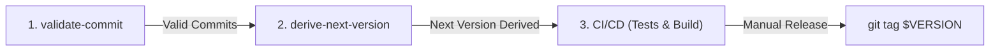

# Derive Next Version Action (`derive-next-version`)

A standalone, zero-dependency GitHub Action that discovers the previous release tag from GitHub and calculates the next **Semantic Versioning 2.0** version (`X.Y.Z`) from **Conventional Commits**.

Built with **TypeScript**, running natively on **Node 24**, and pre-bundled into a single standalone executable (`dist/index.js`) using **`@vercel/ncc`**—zero `npm install` overhead at runtime.

---

## 🏛️ Core Principles

- **Strict SemVer 2.0 (`X.Y.Z` only)**: Outputs always format as clean `X.Y.Z` (e.g., `2.0.0`, `1.3.0`, `1.2.4`). No leading `v` prefix.
- **Identical Standards with `validate-commit`**: Uses the exact same Conventional Commits types, breaking change indicators, and Jira ticket prefix/suffix stripping logic.
- **Manual Git Tag Friendly**: Does not modify git refs or push tags over the GitHub API. It strictly computes and exports the version so subsequent jobs or maintainers can run `git tag` manually.
- **Zero-Drift & Standalone**: Pre-compiled with `@vercel/ncc` into `dist/index.js` and validated against CI anti-drift checks.

---

## 🚀 How It Works

1. **Discovers Previous Version**:
   - Queries the GitHub REST API for all repository tags via pagination.
   - Extracts and sorts valid SemVer tags descending to identify the highest previous version (e.g. `1.2.3`).
   - If no tags exist, falls back to `default-version` (default: `0.1.0`).

2. **Analyzes Commits**:
   - Compares commits between the latest tag ref and current `HEAD` commit (or lists recent commits if no prior tag exists).
   - Cleans commit headers by stripping Jira issue tags (e.g. `[PROJ-123]`, `PROJ-123:`, `(PROJ-123)`).

3. **Determines the Bump**:
   Evaluates messages against the Conventional Commits specification:

   | Commit Pattern | Example | Bump Type | Result from `1.2.3` |
   |---|---|:---:|:---:|
   | `!` breaking indicator or `BREAKING CHANGE:` | `feat!: drop node 18` or `fix: ...\n\nBREAKING CHANGE: ...` | **MAJOR** | `2.0.0` |
   | `feat(...)` | `feat(auth): add OAuth2 provider` | **MINOR** | `1.3.0` |
   | `fix(...)`, `perf(...)`, `refactor(...)`, `revert(...)` | `fix: resolve race condition`, `perf: cache index` | **PATCH** | `1.2.4` |
   | `build(...)`, `chore(...)`, `ci(...)`, `docs(...)`, `style(...)`, `test(...)` | `chore: update deps`, `docs: fix typo` | **NONE** | `1.2.3` |

   > **Precedence**: `MAJOR` > `MINOR` > `PATCH` > `NONE`. Breaking changes take absolute priority.

4. **Applies & Exports the Version**:
   - Sets `$GITHUB_OUTPUT` parameters: `previous_version`, `version`, `version_clean`, `bump_type`, `has_bump`.
   - Exports environment variables `$VERSION` and `$NEXT_VERSION` into `$GITHUB_ENV` for downstream steps.
   - Generates a markdown summary in the GitHub Actions Job Summary overview tab.

---

## 📥 Inputs

| Input | Description | Required | Default |
|---|---|:---:|---|
| `github-token` | GitHub token for querying repository tags and commit comparisons | No | `${{ github.token }}` |
| `default-version` | Initial baseline fallback version when no tags exist in the repo | No | `0.1.0` |

---

## 📤 Outputs

All version outputs are formatted strictly as raw **`X.Y.Z`**:

| Output | Description | Example |
|---|---|---|
| `previous_version` | Last identified valid SemVer tag (`X.Y.Z`), or empty string if initial | `1.2.3` |
| `version` | Next derived SemVer 2.0 version (`X.Y.Z`) | `1.3.0` |
| `bump_type` | Detected bump: `major`, `minor`, `patch`, or `none` | `minor` |
| `has_bump` | Whether a version increment occurred (`true` or `false`) | `true` |

---

## 🌍 Environment Variables Exported

The action exports the following variables into `$GITHUB_ENV`:

| Variable | Format | Description | Example |
|---|---|---|---|
| `$VERSION` | `X.Y.Z` | Clean SemVer 2.0 calculated version | `1.3.0` |
| `$NEXT_VERSION` | `X.Y.Z` | Clean SemVer 2.0 calculated version | `1.3.0` |

---

## 🔄 Sequential Pipeline Integration

In production workflows, run actions in sequence on Pull Requests:



```yaml
name: "PR & Release Pipeline"

on:
  pull_request:
    types: [opened, synchronize, reopened]

jobs:
  # 1. Validate PR Commits
  validate-commits:
    runs-on: ubuntu-latest
    steps:
      - uses: actions/checkout@v4
      - uses: ronmkr/r_git_actions/actions/validate-commit@v1
        with:
          check-conventional-commit: "true"

  # 2. Derive Next Version
  find-version:
    runs-on: ubuntu-latest
    needs: [validate-commits]
    outputs:
      version: ${{ steps.semver.outputs.version }}
      bump: ${{ steps.semver.outputs.bump_type }}
    steps:
      - uses: actions/checkout@v4
        with:
          fetch-depth: 0
      - id: semver
        uses: ronmkr/r_git_actions/actions/derive-next-version@v1
        with:
          github-token: ${{ secrets.GITHUB_TOKEN }}
          default-version: "0.1.0"
      - run: |
          echo "Calculated Version: ${{ steps.semver.outputs.version }}"
          echo "Env Version: $VERSION"

  # 3. CI/CD Suite
  build-and-test:
    runs-on: ubuntu-latest
    needs: [find-version]
    steps:
      - uses: actions/checkout@v4
      - run: npm test && npm run build
```
