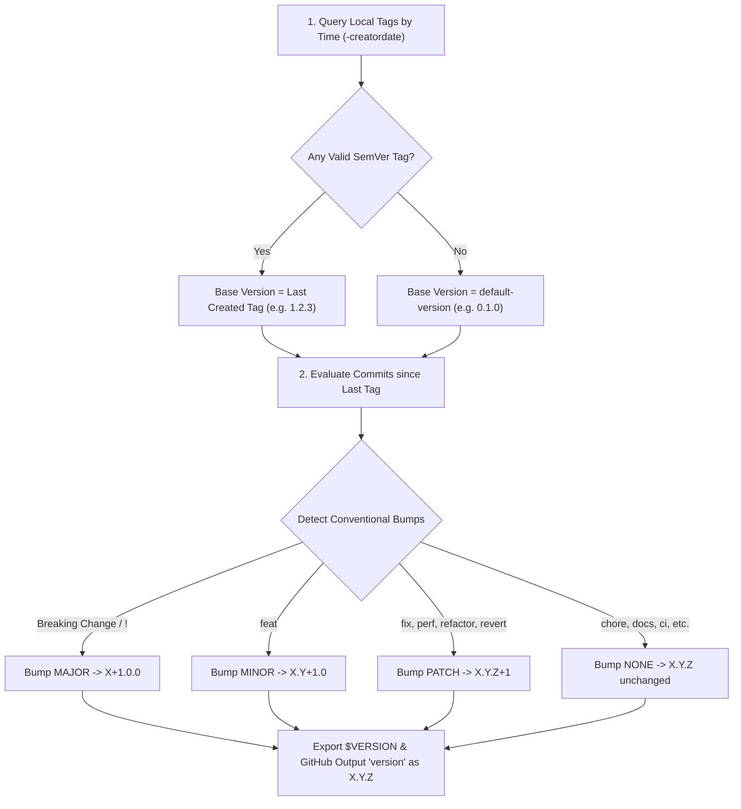

# Conventional Commits & Versioning Guide

This guide explains the **Conventional Commits specification** and how **`validate-commit`** and **`derive-next-version`** collaborate to automatically calculate and export the next release version (`X.Y.Z`).

---

## 📌 1. Conventional Commits Standard

Every commit message follows a structured format:

```text
<type>[optional scope][!]: <description>

[optional body]

[optional footer(s)]
```

### Commit Types & Version Bumps

| Commit Type | Purpose | SemVer Bump | Example | Next from `1.2.3` |
|---|---|:---:|---|:---:|
| `!` or `BREAKING CHANGE:` | Breaking change in API or behavior | **MAJOR** | `feat!: drop Node 18 support` | **`2.0.0`** |
| `feat` | New feature or capability | **MINOR** | `feat(auth): support Google OAuth2` | **`1.3.0`** |
| `fix` | Bug fix | **PATCH** | `fix: handle null tag scenario` | **`1.2.4`** |
| `perf` | Performance improvement | **PATCH** | `perf: cache repository tags` | **`1.2.4`** |
| `refactor` | Code refactor (no bug fix or feature) | **PATCH** | `refactor: simplify token parsing` | **`1.2.4`** |
| `revert` | Reverting a previous commit | **PATCH** | `revert: rollback broken auth commit` | **`1.2.4`** |
| `build` | Changes to build system or dependencies | **NONE** | `build(deps): bump @vercel/ncc` | `1.2.3` |
| `chore` | Routine maintenance or tasks | **NONE** | `chore: update .gitignore` | `1.2.3` |
| `ci` | Changes to CI/CD workflows and scripts | **NONE** | `ci: add test step to GitHub Actions` | `1.2.3` |
| `docs` | Documentation-only changes | **NONE** | `docs: add release guidelines` | `1.2.3` |
| `style` | Formatting, whitespace (no code change) | **NONE** | `style: run prettier format` | `1.2.3` |
| `test` | Adding or fixing test cases | **NONE** | `test: add unit tests for bump rules` | `1.2.3` |

> ⚠️ **Bump Priority**: `MAJOR` > `MINOR` > `PATCH` > `NONE`.  
> Breaking changes take absolute precedence over all other commit types.

---

## 🏷️ 2. Jira Issue Keys & Custom Regex Support

Both bracket prefixes, colon prefixes, and suffix tags are supported:

- `[PROJ-101] feat: add user authentication`
- `PROJ-101: fix(db): resolve connection pool leak`
- `feat(api): export customer report [CORE-456]`
- `feat: implement logout (PROJ-789)`

Before evaluating the Conventional Commit specification, `validate-commit` automatically strips any Jira prefix/suffix, allowing committers to link tickets without violating formatting standards.

---

## 🔢 3. How Versions are Derived (`derive-next-version`)



### Step-by-Step Logic:

1. **Chronological Baseline Discovery**:
   - Discovers previous release tags sorted strictly by **creation timestamp** (`git for-each-ref --sort=-creatordate refs/tags`).
   - The most recently created tag becomes the baseline version (e.g., `v1.2.3` becomes `1.2.3`).
   - If no tags exist, it uses `default-version` (`0.1.0`).

2. **Commit Analysis**:
   - Compares commits between the baseline tag ref and `HEAD`.
   - Analyzes all messages against the Conventional Commits specification.

3. **Determines the Bump Type**:
   - Scans for breaking changes (`!` indicator in header or `BREAKING CHANGE:` / `BREAKING-CHANGE:` in body).
   - If no breaking change exists, checks for `feat` $\rightarrow$ `minor`.
   - If no `feat` exists, checks for `fix`, `perf`, `refactor`, or `revert` $\rightarrow$ `patch`.
   - Otherwise $\rightarrow$ `none`.

4. **Strict `X.Y.Z` Output**:
   - The derived version is always formatted strictly as **`X.Y.Z`** (never `vX.Y.Z`).
   - Exports output parameters:
     - `previous_version`: Previous version (`1.2.3` or `""`)
     - `version`: Next version (`1.3.0`)
     - `bump_type`: `major`, `minor`, `patch`, or `none`
     - `has_bump`: `true` or `false`
   - Exports environment variables into `$GITHUB_ENV`:
     - `$VERSION`: Next version (`1.3.0`)
     - `$NEXT_VERSION`: Next version (`1.3.0`)

---

## 🚀 4. Sequential PR Pipeline Example

To run commit validation, version derivation, and CI/CD tests in order:

```yaml
name: "PR Verification & Versioning"

on:
  pull_request:
    types: [opened, synchronize, reopened]

jobs:
  # Step 1: Validate PR Commits
  validate-commits:
    name: "1. Validate PR Commits"
    runs-on: ubuntu-latest
    steps:
      - name: Checkout repository
        uses: actions/checkout@v4

      - name: Validate Conventional Commits
        uses: ronmkr/r_git_actions/actions/validate-commit@v1
        with:
          github-token: ${{ secrets.GITHUB_TOKEN }}
          check-conventional-commit: "true"
          require-jira-id: "false"

  # Step 2: Calculate Next SemVer Version
  calculate-version:
    name: "2. Calculate Next Version"
    runs-on: ubuntu-latest
    needs: [validate-commits]
    outputs:
      version: ${{ steps.semver.outputs.version }}
      bump_type: ${{ steps.semver.outputs.bump_type }}
      has_bump: ${{ steps.semver.outputs.has_bump }}
    steps:
      - name: Checkout repository with tags
        uses: actions/checkout@v4
        with:
          fetch-depth: 0

      - name: Derive Next Version
        id: semver
        uses: ronmkr/r_git_actions/actions/derive-next-version@v1
        with:
          github-token: ${{ secrets.GITHUB_TOKEN }}
          default-version: "0.1.0"

      - name: Display Next Version
        run: |
          echo "Next Version: ${{ steps.semver.outputs.version }}"
          echo "Bump Type:    ${{ steps.semver.outputs.bump_type }}"
          echo "Environment:  $VERSION"

  # Step 3: CI/CD Testing & Building
  build-and-test:
    name: "3. CI/CD Suite"
    runs-on: ubuntu-latest
    needs: [calculate-version]
    steps:
      - name: Checkout repository
        uses: actions/checkout@v4

      - name: Build & Run Test Suites
        run: |
          echo "Building release for version ${{ needs.calculate-version.outputs.version }}"
          npm test
```
